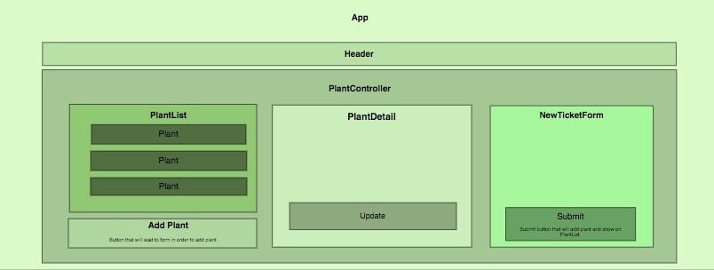

# Green Thumb Supply

A React application that will keep track of inventory for a local gardening shop.

#### *By Najma Abdi*

&nbsp;

## Technologies Used
* React
* JavaScript
* Node.js

## Description

In this application, it will keep track of inventory for a local market that sells seeds.

- As a user you will be able to
    - see a list of all available types of plant seeds.
        For each plant, you will see its name, origin, price, planting season and needs.
    - submit a form to add new plants to the inventory.
    - be able to click on plant seeds to see its detail page.
    - see how many pounds of seeds are left in a buckhorn container, which can hold roughly 2000 pounds.
    - be able to click a button to sell a pound of seeds. This should decrease the number of pounds left by 1. The number of pounds in a sack of plants should not be able to go below 0.

## Installation Requirements 
You must make sure the following software packages are locally installed in order to use this application:
- A preferred code editor *(my case: VS Code)*
- Node.js

## Setup

- Clone the repository by running "*git clone https://github.com/anajmabdi/green-thumb-supply.git*" in the terminal after moving to the desktop folder.
- Run "*code green-thumb-supply*" to open folder in code editor.

## Available Scripts

In the project directory, you can run:

### `npm start`

Runs the app in the development mode.\
Open [http://localhost:3000](http://localhost:3000) to view it in your browser.

The page will reload when you make changes.\
You may also see any lint errors in the console.

### `npm test`

Launches the test runner in the interactive watch mode.\
See the section about [running tests](https://facebook.github.io/create-react-app/docs/running-tests) for more information.

### `npm run build`

Builds the app for production to the `build` folder.\
It correctly bundles React in production mode and optimizes the build for the best performance.

The build is minified and the filenames include the hashes.\
Your app is ready to be deployed!

See the section about [deployment](https://facebook.github.io/create-react-app/docs/deployment) for more information.

### `npm run eject`

**Note: this is a one-way operation. Once you `eject`, you can't go back!**

If you aren't satisfied with the build tool and configuration choices, you can `eject` at any time. This command will remove the single build dependency from your project.

Instead, it will copy all the configuration files and the transitive dependencies (webpack, Babel, ESLint, etc) right into your project so you have full control over them. All of the commands except `eject` will still work, but they will point to the copied scripts so you can tweak them. At this point you're on your own.

You don't have to ever use `eject`. The curated feature set is suitable for small and middle deployments, and you shouldn't feel obligated to use this feature. However we understand that this tool wouldn't be useful if you couldn't customize it when you are ready for it.

&nbsp;

## Known Bugs

*None*

&nbsp;

# License

MIT License

Copyright (c) [2023] [Najma Abdi]

Permission is hereby granted, free of charge, to any person obtaining a copy of this software and associated documentation files (the "Software"), to deal in the Software without restriction, including without limitation the rights to use, copy, modify, merge, publish, distribute, sublicense, and/or sell copies of the Software, and to permit persons to whom the Software is furnished to do so, subject to the following conditions:

